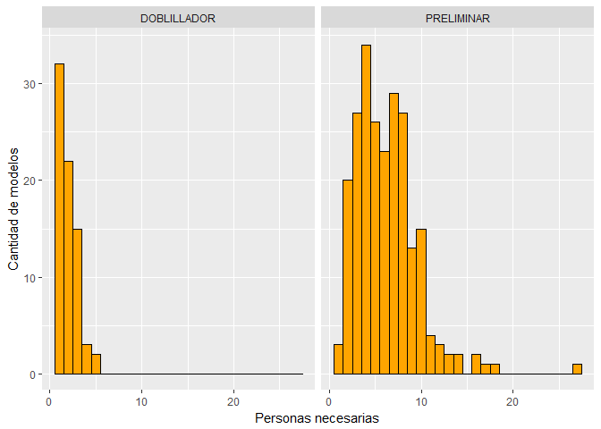
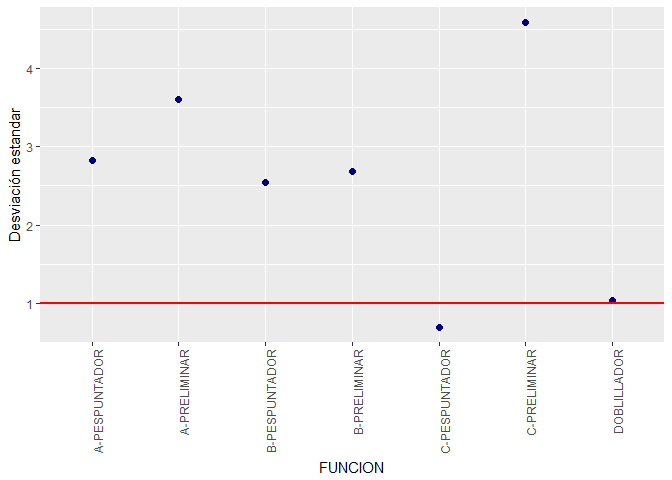
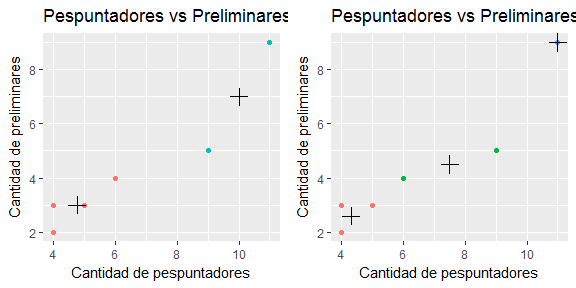
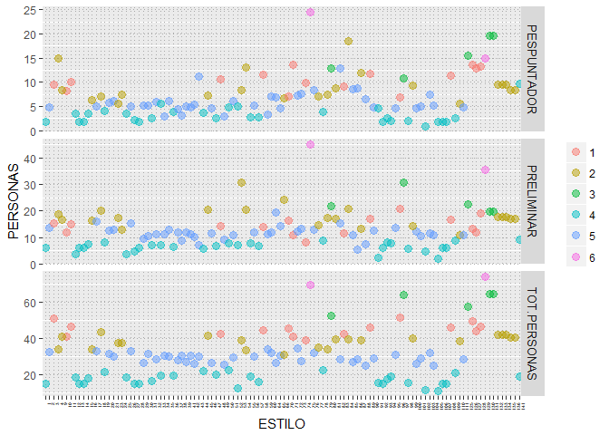

# Subir la eficiencia de pespunte creando familias de productos
Luis Espinosa Bouvy - espinosabouvy@gmail.com  
4 de noviembre de 2016  
.  


  
  
####RESUMEN
Crear familias de productos que tengan tiempos de proceso similar en el pespunte, es decir, una necesidad de personal especializado con la menor desviación posible entre un producto y otro, genera estabilidad en la producción, una menor diferencia entre las capacidades de producción diaria y mayores eficiencias en el balanceo del trabajo.  

Si conocemos los tiempos de proceso de cada modelo que vamos a producir y los conocimientos que debe tener la persona que debe realizar cada operacion (su especialización), podemos agrupar modelos para que las diferencias en el tiempo requerido para producirlos sea la menor posible.  Eso es lo que se busca con este análisis.  

Al final del artículo se puede encontrar la agrupación final de los modelos que usaron para este ejercicio.  


#### CONCEPTOS GENERALES
Para aclarar algunos conceptos que encontraremos más adelante en este artículo explicaremos algunos de ellos.

1. Cada producto requiere, por ejemplo, que un pespuntador-A (experto) realice ciertas costuras para el armado del zapato, dichas costuras requieren un tiempo y dicho tiempo es diferente para cada modelo, lo mismo pasa para las preliminares, los doblilladores o rebajadores.  Esto hace que necesitemos diferente cantidad de personas de cada puesto para producir diferentes modelos.

2. Cuando queremos saber cuál es nuestra necesidad de personal, lo que normalmente hacemos, es multiplicar el tiempo que se debe invertir en cada par, lo multiplicamos por los pares que debemos producir (o proyectamos producir) y eso lo dividimos entre tiempo que tenemos disponible cada día y con eso sabemos cuantas personas necesitamos.

Por ejemplo:

|Pares vendidos|Tiempo Pespuntador-A|Tiempo total|Horas Trabajo|Personas   |
|--------------|--------------------|------------|-------------|-----------|
|1000 pares    | 55 segundos/ par   |55000 seg.  |  8 hrs      | 1.9 pers  |  

Es decir, necesitamos 2 pespuntadores-A para producir 1000 pares por día.

Pero, que pasa cuando debemos producir 200 pares de estilo 2, que requiere 35 segundos por par de un pespuntador-A, 144 pares del estilo 2, que requiere 16 seg/par de un pesuntador-A, etc. Y además, tenemos pespuntadores-A,B y C, preliminares A,B,C, rebajadores, doblilladores, cortadores, etc.  El cálculo se complica mucho más, como podemos ver en la siguiente gráfica que representa las diferencias entre las necesidades de personal de los modelos de este ejercicio.  

<!--html_preserve--><div id="htmlwidget-f3bf7514f355f6ed7ad7" style="width:672px;height:480px;" class="plotly html-widget"></div>
<script type="application/json" data-for="htmlwidget-f3bf7514f355f6ed7ad7">{"x":{"layout":{"margin":{"b":40,"l":60,"t":25,"r":10},"xaxis":{"domain":[0,1],"title":"PUESTO","type":"category","categoryorder":"array","categoryarray":["C-PESPUNTADOR","C-PRELIMINAR","DOBLILLADOR","PESPUNTADOR","PRELIMINAR"]},"yaxis":{"domain":[0,1],"title":"PERSONAS"}},"source":"A","config":{"modeBarButtonsToAdd":[{"name":"Collaborate","icon":{"width":1000,"ascent":500,"descent":-50,"path":"M487 375c7-10 9-23 5-36l-79-259c-3-12-11-23-22-31-11-8-22-12-35-12l-263 0c-15 0-29 5-43 15-13 10-23 23-28 37-5 13-5 25-1 37 0 0 0 3 1 7 1 5 1 8 1 11 0 2 0 4-1 6 0 3-1 5-1 6 1 2 2 4 3 6 1 2 2 4 4 6 2 3 4 5 5 7 5 7 9 16 13 26 4 10 7 19 9 26 0 2 0 5 0 9-1 4-1 6 0 8 0 2 2 5 4 8 3 3 5 5 5 7 4 6 8 15 12 26 4 11 7 19 7 26 1 1 0 4 0 9-1 4-1 7 0 8 1 2 3 5 6 8 4 4 6 6 6 7 4 5 8 13 13 24 4 11 7 20 7 28 1 1 0 4 0 7-1 3-1 6-1 7 0 2 1 4 3 6 1 1 3 4 5 6 2 3 3 5 5 6 1 2 3 5 4 9 2 3 3 7 5 10 1 3 2 6 4 10 2 4 4 7 6 9 2 3 4 5 7 7 3 2 7 3 11 3 3 0 8 0 13-1l0-1c7 2 12 2 14 2l218 0c14 0 25-5 32-16 8-10 10-23 6-37l-79-259c-7-22-13-37-20-43-7-7-19-10-37-10l-248 0c-5 0-9-2-11-5-2-3-2-7 0-12 4-13 18-20 41-20l264 0c5 0 10 2 16 5 5 3 8 6 10 11l85 282c2 5 2 10 2 17 7-3 13-7 17-13z m-304 0c-1-3-1-5 0-7 1-1 3-2 6-2l174 0c2 0 4 1 7 2 2 2 4 4 5 7l6 18c0 3 0 5-1 7-1 1-3 2-6 2l-173 0c-3 0-5-1-8-2-2-2-4-4-4-7z m-24-73c-1-3-1-5 0-7 2-2 3-2 6-2l174 0c2 0 5 0 7 2 3 2 4 4 5 7l6 18c1 2 0 5-1 6-1 2-3 3-5 3l-174 0c-3 0-5-1-7-3-3-1-4-4-5-6z"},"click":"function(gd) { \n        // is this being viewed in RStudio?\n        if (location.search == '?viewer_pane=1') {\n          alert('To learn about plotly for collaboration, visit:\\n https://cpsievert.github.io/plotly_book/plot-ly-for-collaboration.html');\n        } else {\n          window.open('https://cpsievert.github.io/plotly_book/plot-ly-for-collaboration.html', '_blank');\n        }\n      }"}],"modeBarButtonsToRemove":["sendDataToCloud"]},"data":[{"x":["PRELIMINAR","PRELIMINAR","PESPUNTADOR","C-PRELIMINAR","DOBLILLADOR","PRELIMINAR","PESPUNTADOR","PRELIMINAR","PESPUNTADOR","DOBLILLADOR","C-PRELIMINAR","PESPUNTADOR","C-PRELIMINAR","PESPUNTADOR","C-PESPUNTADOR","PRELIMINAR","PRELIMINAR","DOBLILLADOR","PESPUNTADOR","PRELIMINAR","PESPUNTADOR","PRELIMINAR","PRELIMINAR","PRELIMINAR","PESPUNTADOR","PRELIMINAR","C-PESPUNTADOR","PESPUNTADOR","C-PRELIMINAR","PRELIMINAR","C-PRELIMINAR","PESPUNTADOR","DOBLILLADOR","PESPUNTADOR","PRELIMINAR","PRELIMINAR","PESPUNTADOR","PESPUNTADOR","PRELIMINAR","C-PRELIMINAR","PRELIMINAR","C-PRELIMINAR","PRELIMINAR","PESPUNTADOR","C-PRELIMINAR","DOBLILLADOR","PRELIMINAR","PRELIMINAR","PESPUNTADOR","PRELIMINAR","PRELIMINAR","C-PRELIMINAR","DOBLILLADOR","PESPUNTADOR","C-PRELIMINAR","PESPUNTADOR","DOBLILLADOR","PRELIMINAR","PRELIMINAR","C-PRELIMINAR","PRELIMINAR","DOBLILLADOR","PRELIMINAR","PESPUNTADOR","PESPUNTADOR","PRELIMINAR","C-PESPUNTADOR","DOBLILLADOR","PRELIMINAR","PESPUNTADOR","C-PRELIMINAR","C-PESPUNTADOR","DOBLILLADOR","PRELIMINAR","C-PRELIMINAR","PRELIMINAR","PESPUNTADOR","PESPUNTADOR","PRELIMINAR","PESPUNTADOR","PESPUNTADOR","C-PRELIMINAR","PRELIMINAR","DOBLILLADOR","DOBLILLADOR","C-PESPUNTADOR","PRELIMINAR","C-PRELIMINAR","PESPUNTADOR","PRELIMINAR","PESPUNTADOR","PRELIMINAR","PESPUNTADOR","PRELIMINAR","PESPUNTADOR","C-PRELIMINAR","DOBLILLADOR","PRELIMINAR","C-PRELIMINAR","PESPUNTADOR","PRELIMINAR","DOBLILLADOR","PESPUNTADOR","C-PESPUNTADOR","C-PRELIMINAR","PESPUNTADOR","PRELIMINAR","PRELIMINAR","PESPUNTADOR","DOBLILLADOR","C-PRELIMINAR","PESPUNTADOR","PRELIMINAR","PRELIMINAR","PRELIMINAR","DOBLILLADOR","C-PRELIMINAR","PESPUNTADOR","PESPUNTADOR","PRELIMINAR","PESPUNTADOR","PRELIMINAR","PRELIMINAR","C-PRELIMINAR","PESPUNTADOR","PESPUNTADOR","PRELIMINAR","DOBLILLADOR","C-PRELIMINAR","PRELIMINAR","PRELIMINAR","PRELIMINAR","PESPUNTADOR","PESPUNTADOR","DOBLILLADOR","C-PRELIMINAR","PRELIMINAR","PESPUNTADOR","DOBLILLADOR","C-PRELIMINAR","PRELIMINAR","PESPUNTADOR","DOBLILLADOR","PRELIMINAR","C-PRELIMINAR","PRELIMINAR","PESPUNTADOR","PRELIMINAR","DOBLILLADOR","PESPUNTADOR","C-PRELIMINAR","PRELIMINAR","PESPUNTADOR","PESPUNTADOR","PRELIMINAR","PRELIMINAR","PESPUNTADOR","C-PRELIMINAR","PRELIMINAR","PESPUNTADOR","PRELIMINAR","C-PRELIMINAR","DOBLILLADOR","C-PRELIMINAR","DOBLILLADOR","PESPUNTADOR","PESPUNTADOR","PRELIMINAR","PRELIMINAR","PESPUNTADOR","PESPUNTADOR","PRELIMINAR","PRELIMINAR","C-PRELIMINAR","DOBLILLADOR","C-PRELIMINAR","DOBLILLADOR","PESPUNTADOR","C-PESPUNTADOR","PRELIMINAR","PRELIMINAR","PESPUNTADOR","PRELIMINAR","PRELIMINAR","C-PESPUNTADOR","C-PRELIMINAR","DOBLILLADOR","PESPUNTADOR","PRELIMINAR","PESPUNTADOR","PESPUNTADOR","PRELIMINAR","C-PRELIMINAR","DOBLILLADOR","PESPUNTADOR","DOBLILLADOR","PRELIMINAR","PRELIMINAR","C-PRELIMINAR","PRELIMINAR","PRELIMINAR","C-PRELIMINAR","C-PESPUNTADOR","PESPUNTADOR","PESPUNTADOR","DOBLILLADOR","C-PRELIMINAR","PRELIMINAR","DOBLILLADOR","PESPUNTADOR","PESPUNTADOR","PRELIMINAR","C-PESPUNTADOR","PRELIMINAR","PESPUNTADOR","PRELIMINAR","DOBLILLADOR","C-PRELIMINAR","PRELIMINAR","PESPUNTADOR","PRELIMINAR","C-PRELIMINAR","PRELIMINAR","PESPUNTADOR","DOBLILLADOR","DOBLILLADOR","PRELIMINAR","PESPUNTADOR","PRELIMINAR","C-PRELIMINAR","PRELIMINAR","PESPUNTADOR","PRELIMINAR","C-PRELIMINAR","DOBLILLADOR","PESPUNTADOR","PESPUNTADOR","PRELIMINAR","C-PESPUNTADOR","DOBLILLADOR","C-PRELIMINAR","PRELIMINAR","PESPUNTADOR","PRELIMINAR","C-PESPUNTADOR","PRELIMINAR","DOBLILLADOR","C-PRELIMINAR","C-PRELIMINAR","PRELIMINAR","PRELIMINAR","DOBLILLADOR","PESPUNTADOR","PESPUNTADOR","C-PRELIMINAR","C-PESPUNTADOR","PRELIMINAR","PESPUNTADOR","PRELIMINAR","PRELIMINAR","PRELIMINAR","PESPUNTADOR","PESPUNTADOR","PESPUNTADOR","PESPUNTADOR","PRELIMINAR","PRELIMINAR","PRELIMINAR","PESPUNTADOR","PRELIMINAR","PRELIMINAR","PRELIMINAR","PESPUNTADOR","PESPUNTADOR","C-PRELIMINAR","DOBLILLADOR","PRELIMINAR","PRELIMINAR","PESPUNTADOR","C-PRELIMINAR","PRELIMINAR","PRELIMINAR","PESPUNTADOR","DOBLILLADOR","PESPUNTADOR","PRELIMINAR","DOBLILLADOR","C-PRELIMINAR","PRELIMINAR","PESPUNTADOR","PESPUNTADOR","C-PRELIMINAR","DOBLILLADOR","PRELIMINAR","PESPUNTADOR","C-PESPUNTADOR","PESPUNTADOR","PRELIMINAR","DOBLILLADOR","C-PESPUNTADOR","PRELIMINAR","PRELIMINAR","C-PRELIMINAR","PESPUNTADOR","PRELIMINAR","C-PESPUNTADOR","PRELIMINAR","PESPUNTADOR","C-PRELIMINAR","PESPUNTADOR","DOBLILLADOR","PESPUNTADOR","PRELIMINAR","PRELIMINAR","PRELIMINAR","PESPUNTADOR","DOBLILLADOR","PESPUNTADOR","PRELIMINAR","C-PESPUNTADOR","PRELIMINAR","C-PRELIMINAR","PRELIMINAR","PESPUNTADOR","PESPUNTADOR","PRELIMINAR","PRELIMINAR","PESPUNTADOR","PRELIMINAR","PRELIMINAR","PESPUNTADOR","C-PESPUNTADOR","C-PRELIMINAR","C-PESPUNTADOR","PESPUNTADOR","PRELIMINAR","PESPUNTADOR","C-PRELIMINAR","PRELIMINAR","PRELIMINAR","C-PRELIMINAR","PESPUNTADOR","PESPUNTADOR","PRELIMINAR","C-PESPUNTADOR","PRELIMINAR","PESPUNTADOR","PRELIMINAR","PESPUNTADOR","C-PRELIMINAR","PRELIMINAR","PRELIMINAR","C-PRELIMINAR","PESPUNTADOR","PESPUNTADOR","DOBLILLADOR","PESPUNTADOR","PESPUNTADOR","PESPUNTADOR","PRELIMINAR","PRELIMINAR","PRELIMINAR","PRELIMINAR","PRELIMINAR","PESPUNTADOR","C-PRELIMINAR","PESPUNTADOR","C-PRELIMINAR","PRELIMINAR","PESPUNTADOR","PRELIMINAR","C-PRELIMINAR","PESPUNTADOR","PRELIMINAR","PRELIMINAR","PESPUNTADOR","C-PRELIMINAR","PRELIMINAR","DOBLILLADOR","PRELIMINAR","PESPUNTADOR","C-PRELIMINAR","PESPUNTADOR","DOBLILLADOR","PRELIMINAR","PESPUNTADOR","PRELIMINAR","DOBLILLADOR","PESPUNTADOR","PESPUNTADOR","C-PRELIMINAR","PRELIMINAR","PRELIMINAR","PRELIMINAR","PRELIMINAR","PESPUNTADOR","PRELIMINAR","PRELIMINAR","C-PESPUNTADOR","PESPUNTADOR","C-PRELIMINAR","PRELIMINAR","DOBLILLADOR","PESPUNTADOR","PRELIMINAR","PESPUNTADOR","PESPUNTADOR","PRELIMINAR","PRELIMINAR","PRELIMINAR","PESPUNTADOR","PESPUNTADOR","PRELIMINAR","DOBLILLADOR","C-PRELIMINAR","PRELIMINAR","PRELIMINAR","PESPUNTADOR","PESPUNTADOR","C-PRELIMINAR","DOBLILLADOR","PESPUNTADOR","PRELIMINAR","PRELIMINAR","C-PRELIMINAR","DOBLILLADOR","PESPUNTADOR","C-PRELIMINAR","DOBLILLADOR","PESPUNTADOR","PESPUNTADOR","PRELIMINAR","PRELIMINAR","PESPUNTADOR","PRELIMINAR","C-PESPUNTADOR","PRELIMINAR","DOBLILLADOR","C-PRELIMINAR","PESPUNTADOR","PRELIMINAR","PESPUNTADOR","PRELIMINAR","C-PRELIMINAR","DOBLILLADOR","PESPUNTADOR","PRELIMINAR","PRELIMINAR","PESPUNTADOR","C-PRELIMINAR","PRELIMINAR","PRELIMINAR","C-PRELIMINAR","PESPUNTADOR","DOBLILLADOR","PRELIMINAR","PRELIMINAR","C-PRELIMINAR","PESPUNTADOR","PESPUNTADOR","DOBLILLADOR","PRELIMINAR","PESPUNTADOR","DOBLILLADOR","PRELIMINAR","C-PRELIMINAR","PRELIMINAR","C-PRELIMINAR","PRELIMINAR","PESPUNTADOR","PESPUNTADOR","DOBLILLADOR","C-PESPUNTADOR","PESPUNTADOR","PRELIMINAR","C-PRELIMINAR","PESPUNTADOR","PRELIMINAR","DOBLILLADOR","PESPUNTADOR","PRELIMINAR","PESPUNTADOR","PRELIMINAR","C-PESPUNTADOR","C-PRELIMINAR","DOBLILLADOR","C-PRELIMINAR","PRELIMINAR","PESPUNTADOR","PRELIMINAR","DOBLILLADOR","C-PRELIMINAR","PRELIMINAR","PESPUNTADOR","PRELIMINAR","PESPUNTADOR","PESPUNTADOR","PRELIMINAR","PESPUNTADOR","DOBLILLADOR","C-PRELIMINAR","PRELIMINAR","DOBLILLADOR","PRELIMINAR","PESPUNTADOR","PESPUNTADOR","PRELIMINAR","C-PRELIMINAR","DOBLILLADOR","PESPUNTADOR","PRELIMINAR","C-PRELIMINAR","PRELIMINAR","PRELIMINAR","PESPUNTADOR","DOBLILLADOR","PRELIMINAR","C-PRELIMINAR","PESPUNTADOR","C-PRELIMINAR","PRELIMINAR","DOBLILLADOR","PESPUNTADOR","PRELIMINAR","PESPUNTADOR","C-PRELIMINAR","PRELIMINAR","PESPUNTADOR","PRELIMINAR","PESPUNTADOR","C-PRELIMINAR","PRELIMINAR","DOBLILLADOR","PESPUNTADOR","C-PRELIMINAR","PRELIMINAR","DOBLILLADOR","PRELIMINAR","PRELIMINAR","PRELIMINAR","C-PRELIMINAR","C-PESPUNTADOR","PESPUNTADOR","PESPUNTADOR","DOBLILLADOR","C-PRELIMINAR","DOBLILLADOR","PRELIMINAR","PRELIMINAR","PESPUNTADOR","DOBLILLADOR","C-PRELIMINAR","PRELIMINAR","PRELIMINAR","PESPUNTADOR","C-PESPUNTADOR","DOBLILLADOR","PRELIMINAR","C-PRELIMINAR","PESPUNTADOR","PRELIMINAR","PESPUNTADOR","PESPUNTADOR","PRELIMINAR","PRELIMINAR","PESPUNTADOR","C-PRELIMINAR","C-PESPUNTADOR","PRELIMINAR","PESPUNTADOR","PRELIMINAR","PESPUNTADOR","C-PESPUNTADOR","DOBLILLADOR","C-PRELIMINAR","PRELIMINAR","PESPUNTADOR","PRELIMINAR","PESPUNTADOR","C-PRELIMINAR","C-PESPUNTADOR","C-PRELIMINAR","PESPUNTADOR","PRELIMINAR","PESPUNTADOR","PRELIMINAR","PESPUNTADOR","C-PRELIMINAR","PRELIMINAR","C-PESPUNTADOR","PESPUNTADOR","PRELIMINAR","PESPUNTADOR","PRELIMINAR","C-PESPUNTADOR","C-PRELIMINAR","PRELIMINAR","PESPUNTADOR","C-PRELIMINAR","PRELIMINAR","C-PESPUNTADOR","PESPUNTADOR","PRELIMINAR","PESPUNTADOR","C-PRELIMINAR","PRELIMINAR","PESPUNTADOR","PRELIMINAR","C-PESPUNTADOR","PESPUNTADOR","C-PESPUNTADOR","C-PRELIMINAR","PESPUNTADOR","PESPUNTADOR","PRELIMINAR","PRELIMINAR","C-PRELIMINAR","PRELIMINAR","PESPUNTADOR","PRELIMINAR","C-PESPUNTADOR","PESPUNTADOR","PRELIMINAR","PRELIMINAR","PESPUNTADOR","C-PRELIMINAR","PESPUNTADOR","PRELIMINAR","C-PRELIMINAR","PRELIMINAR","PESPUNTADOR","PESPUNTADOR","PRELIMINAR","PESPUNTADOR","PRELIMINAR","PRELIMINAR"],"y":[3.64,2.37,1.79,5.28,0.88,8.15,2,5.41,2.87,1.67,11.12,4.65,22.53,4.76,0.83,8.67,6.67,1.49,14.27,5.99,0.64,5.26,7.58,6.84,0.83,10,1,7.47,13.84,8.83,15.11,4.32,4.5,3.85,3,5.16,5.12,5.02,9.69,20.47,1.8,9.77,2.09,3.51,5.28,0.88,2.37,3.64,1.79,3.64,2.37,5.28,0.88,1.79,4.85,3.49,0.97,3.6,3.9,9.15,8.94,0.83,7.44,6.34,0.88,7.39,0.56,2.49,8.67,4.16,7.66,0.64,1.83,11.67,12.83,8.5,4.33,2.75,3,2.31,1.78,5.97,5.28,2.13,1.82,0.83,7.96,9.5,4.84,4.67,0.83,6.84,2.67,6.23,3.51,8.5,1,6.67,10.13,3.59,10.66,3.33,1.96,1.14,14.29,3,8.23,4.56,4.38,0.88,9.77,3.51,1.8,2.09,6.77,2.7,8.92,2.09,2.94,8.48,0.92,2.83,2,6.8,1.22,1.79,3.64,0.88,5.28,2.37,3,6.6,3.86,1.33,2.94,7.66,6.53,3.33,1.83,12.77,4,1.83,1.3,4.27,5.34,3,2.5,6.52,1.82,3.42,8.53,4.83,2.44,3.49,2.67,4.41,2,6.94,4,2.91,7.28,12.47,2.5,8.5,1,2.67,3.51,6.23,6.84,1.96,1.96,4.01,2.61,6.79,0.97,9.39,1.19,1.89,0.14,6.14,5.68,2.45,3.66,5.34,0.64,15.8,0.83,3.07,9.16,2.94,1.97,2.67,7.2,1.92,4.71,2.94,5,6.15,10.68,3.39,6.69,5.8,0.28,3.34,2,3.45,5.86,2.81,4.27,9.12,1.99,4.43,0.28,2.2,3.6,3.44,1.47,9.95,12.23,1,1.67,10.8,6.69,6.24,1.49,3.13,3.97,4.61,7.69,6.02,3,2.5,3.96,7.55,2,2.38,8.29,10.64,1,1.49,13.77,3.63,2.99,6.07,0.14,3,2.49,9.94,7,4,3.67,2,4.78,5,9.6,1.75,4,1.11,6.74,3.3,4,5,6.83,0.56,0.88,8.5,6.06,16.08,0.88,5.67,7.58,7.13,8.75,3.5,5.82,1.4,2.86,5,2.76,9.45,4.58,7.17,2.24,2.5,3,3.25,0.88,4.4,3.64,1.79,0.88,15.37,1.56,4.08,1.19,0.83,10.34,9.94,1.22,0.83,5.77,5.44,16.29,3.34,7.83,0.83,4.14,3.2,8.28,3.89,2.63,6.92,8,6.48,5,1.79,0.88,2.75,8.29,0.83,6,9.11,11.39,4.99,1.72,9.27,3.41,5,12,4.47,2,2.47,18.21,1,2,5.43,11.69,14.38,5.5,5.35,13.45,3.18,4.11,7.06,0.83,6.25,3.34,7.18,4.25,4.56,5.16,3,17.57,2.13,7.81,2.41,13.65,3.83,6.99,17.69,17.47,9.79,8.41,4.5,7.42,9.44,1,12.26,9.71,7.12,5,8.8,3.78,2.49,6.32,1.92,6.43,10.48,1.59,7.05,5.57,13.61,9.19,2.94,8.84,3.67,12.92,2,6.18,2.64,10.42,9.01,7.99,6.67,3,12.88,5.67,5.16,1.8,9.2,13.61,6.5,5.06,14.82,7.5,3,0.64,5.92,7.27,4.25,2.94,5.56,6.76,1.25,5.32,2.28,3.3,5.12,3.67,10.73,2.2,4.94,5.84,7.44,11.3,1.49,7.01,6.8,3.1,3.67,2.82,3,4.53,6.36,7.57,0.64,9.5,2.67,12.79,5.44,5.16,3.59,7.58,7.44,2.75,1.28,1.49,1,4.69,7,3.64,2.37,5.28,1.79,0.88,4.4,3.9,4.85,1.53,0.97,0.97,4.34,2,1.25,3.49,7.04,8.4,9.22,5.19,2,2.58,2.72,1.83,5.07,13,17.95,1.85,7.67,2.94,9.25,14.5,1.64,16.02,1.83,19.36,0.97,5.82,1.94,1.96,3.88,4,10.97,5.77,1,8.56,8.33,0.83,5.47,3.86,1.28,6.72,6.84,2.56,7.59,2.19,2.88,3,9.53,1.25,0.83,2.67,3.25,2.25,5.61,6.39,2.86,6,9,1,6.08,7.8,2,3.83,3,1.41,6.17,2,1.75,2.37,1.79,5.28,3.64,0.88,1.79,5.28,2.37,0.88,3.64,8.94,7.61,11.85,3.25,0.83,10.44,2,6.55,2,5.33,3.5,2.5,5.26,14.86,3.5,7.44,5.62,0.56,2,5.25,9.58,2.13,5.67,2.66,14.59,8.83,13.55,0.88,16.14,2.13,5.31,11.15,8.1,2.44,0.83,1,19.45,7.67,7.08,4.32,5.7,17.43,0.83,13.09,6.25,11.34,7.04,7.77,3.56,20.58,8.83,1.83,11.38,26.61,8.25,9.88,1.25,22.58,9.83,11.28,22.58,9.83,1.25,11.28,9.88,8.25,11.88,10,1.94,7.77,1.66,7.6,1.66,11.88,7.6,1.94,7.77,10,11.88,7.77,1.94,10,1.66,7.6,7,9.99,8.27,14.02,8.27,9.99,14.02,7,6.47,2.53,2.25,0.64,1,6],"type":"box","line":{"fillcolor":"rgba(31,119,180,1)","color":"rgba(31,119,180,1)"},"xaxis":"x","yaxis":"y"}],"base_url":"https://plot.ly"},"evals":["config.modeBarButtonsToAdd.0.click"],"jsHooks":[]}</script><!--/html_preserve-->

La gráfica muestra como están distribuidas las necesidades de cada tipo de operario, por ejemplo, los C-Preliminar:


```
##      0%     25%     50%     75%    100% 
##  3.2500  6.7925  9.5150 13.3600 22.5800
```

Esto quiere decir, y lo podemos ver en la gráfica, que el 50% de los estilos requieren 9.515 personas o menos, el 75% requieren 13.36 o menos, es decir, la gráfica, nos muestra, que tan diferente es la cantidad de gente necesaria para producir la misma cantidad de pares de cada uno.

Como otro ejemplo, podemos ver que los **pespuntadores** requeridos para producir los modelos de nuestro análisis tiene una media de **4.12** y  con un rango de **0.56, 14.82** pespuntadores para producir la misma cantidad de pares para diferentes estilos y una desviación en las   necesidades de **3.05**. *Es decir, tenemos un promedio de 5 pespuntadores, pero podemos llegar a necesitar, desde 1 hasta 26, no parece fácil de administrar.*

3. La desviación estandar en este caso la vamos a definir como la variacion en la necesidad de personal requerido para producir la misma cantidad de pares de diferentes modelos.  

Por ejemplo:  

Los doblilladores tiene una desviación estandar de 1.04 y para los preliminares de 3.32. Esto quiere decir que para producir la misma cantidad de pares de un estilo a otro, la cantidad de doblilladores que se necesitan cambia mucho menos, que cuando hablamos de preliminares, la variación en la necesidad de preliminares es mayor.  Como podemos ver en la gráfica siguiente:  
<!-- -->

Para los doblilladores, encontramos más de 80 modelos que requieren 1 doblillador, casi 50 modelos que requieren 2.  Pero al ver los preliminares, encontramos una menor  cantidad de modelos que requieren una misma cantidad de preliminares, es decir, su variación es mayor (mayor desviación estandar).  

#### TRANSFORMACION Y SIMPLIFICACIÓN
Realizaremos agrupaciones de funciones y descartaremos el uso de algunas otras en este análisis para que sea lo más utilizable en la realidad y sobre todo para que sea interpretable cuando realicemos gráficos y poder ver los resultados de forma sencilla.

1. Los pespuntadores A (expertos) y pespuntadores B (completos), así como prelimares A y B, serán consideradas únicamente como PESPUNTADORES y PRELIMINARES, asumiendo que los tipo B, pueden realizar las operaciones de tipo A, pero con una menor velocidad.  

2. Las funciones que tengan una desviación estandar (dispersión en la necesidad) menor a UNA persona, también serán descartados para el análisis individual, pues simplifica el análisis y la diferencia en la necesidad de estas funciones entre un grupo y otro no ser significativa para decidir si un modelo entra en un grupo o en otro.

En la siguiente gráfica podemos ver las funciones que serán descartadas para el análisis.  

<!-- -->

*Las funciones que no serán tomadas en cuenta en nuestro análisis son aquellas por debajo de la línea roja, que representan una desviación estandar igual a 1*  


3. La última consideración del análisis es agrupar el total de personas, sin tomar en cuenta la funcion o el grado de especialización como un solo valor.  Con esto se busca que la cantidad de personas necesarias, aún si no son críticas, influya de manera importante en la cantidad de pares que pueden ser producidos, al tomar en cuenta el total de personas estamos incluyendo las funciones tipo C, no críticas, pero que son operaciones que no pueden dejar de hacerse, como limpiar, quemar hebras, armar hebillas,
etc, y al mismo tiempo incluimos, pero con un menor "peso" todas aquellas funciones que descartamos anteriormente.  

Por lo tanto buscaremos agrupar los modelos que, al agruparlos en una familia de productos, minimicen la dispersión en la necesidad de los 3 grupos que definimos:  

*  **PESPUNTADOR** (todos los pespuntadores A y B)  
*  **PRELIMINAR** (todos los preliminares A y B)  
*  **TOTAL PERSONAS** (total de personas de todas la funciones)  


#### ANALISIS Y TRANFORMACION DE DATOS  

Utilizando un **analisis de clusters** incluyendo las 3 variables (pespuntadores, preliminares y total de personas), podemos definir un número de familias que agrupen una cantidad significativa de modelos.  Este análisis agrupa los modelos midiendo las distancias entre cada uno de ellos y creando un árbol que las relaciona, más adelante en el artículo se explicará con más detalle la forma en que se realiza el agrupamiento final de modelos.  

Como se puede ver en la siguiente gráfica, generar **6** familias parece una opción razonable, pues a partir del nivel marcado con la línea roja, los modelos empiezan a agruparse en grupos cada vez más pequeños y generando mayor cantidad de familias.  

<!-- -->


Después de utilizar el método de clusters para visualizar como se relacionan los modelos por la cantidad de pespuntadores, preliminares y el total de personas necesarias utilizaremos la metología de clusters K-mean, que genera un "centro" o punto común para un grupo de modelos basandose en la cantidad de personas necesarias para producir cada modelo.

Para explicar un poco como es que se realiza esta agrupación se puede ver la siguiente gráfica:

<!-- -->

En la gráfica izquierda vemos estilos que se agrupan en 2 familias (rojos y azules), donde la cruz representa el "centro" o promedio de cada grupo de puntos.Y en la gráfica derecha, el mismo ejercio, pero creando 3 familias de productos, basandose en agrupar aquellos modelos que generen la menor desviación en la necesidad de cada función.  

Como se puede ver, los resultados son diferentes y las desviaciones entre los puntos con su centro esperaríamos que bajen al crear mayor cantidad de grupos, para definir este número de manera simple e interpretable se utilizó el **Cluster de Agrupamiento**.   

El ejemplo anterior representa, de forma simplificada como será realizado el análisis, pero utilizando la cantidad de pespuntadores, preliminares y el total de personas necesarias para cada estilo.  Al ver ejemplo, nos damos cuenta que podemos definir la cantidad de familias que sean necesarias, aunque al considerar gastos de supervisión, espacio y logística que requiere tener un mayor número de familias, la decisión no involucra únicamente bajar al mínimo la desviación en la necesidad de personas.  

Por supuesto que en este tipo de  análisis se pueden agregar variables como espacio, costo por familia, costo de balanceo del trabajo, pero la intención de este artículo es demostrar lo que puede lograrse utilizando de forma profesional la información que tenemos a la mano para tomar las mejores decisiones.  

El agrupamiento comienza definiendo **6** clusters, en este caso **6** familias para agrupar todos los modelos. Y se puede ver en la siguiente gráfica la forma en que quedan agrupados los modelos.  

<!-- -->

Los gráficos representan el agrupamiento final de los estilos, representando en un color diferente cada familia, tomando en cuenta la relación entre la cantidad de pespuntadores, preliminares y total de personas necesarias.  

<!-- -->

En este gráfico se puede ver la cantidad de *PESPUNTADORES, PRELIMINARES y TOTAL DE PERSONAS* que se requieren para cada estilo, identificados por las familias anterioremente creadadas por medio de clusters. Y el tamaño de cada uno de los puntos representa la cantidad total de personas requeridas, el eje horizontal la cantidad de pespuntadores y el vertical la cantidad de preliminares para producir 100 pares por hora.  
De esta forma podemos ver gráficamente que los modelos con cantidad de pespuntadores similar quedan agrupados, excepto cuando la diferencia en el total de personas cambia de manera notable.  

#RESULTADO

Al iniciar el análisis revisamos que el promedio de pespuntadores para producir 100 pares por hora incluyendo todos los modelos en una solo familia era 4.12, con una desviación estandar de 3.05. Como podemos ver en la sigueinte tabla de promedios y desviaciones para los grupos que generamos. 

```r
     Promedio.total
```

```
##  PESPUNTADOR    PESP.POND   PRELIMINAR TOT.PERSONAS 
##         7.06        14.13        12.90        32.01
```

```r
     Desviacion.total
```

```
##  PESPUNTADOR    PESP.POND   PRELIMINAR TOT.PERSONAS 
##         4.37         8.74         6.60        12.93
```


Después de este ánalisis se definieron 6 familias bien estandarizadas, con promedios de personal requerido bien diferenciado y deviaciones estandar menores, como se puede ver en las tablas finales.

Esto permite:

*  Bajar la cantidad de personal, (el balanceo tendra una eficencia real mayor).  
*  Menor cantidad de movimientos internos y entre familias.
*  Realizar una programación más cercana a la realidad, sin la necesidad de utilizar los tiempos especificos de cada modelo, pues la capacidad de producción para cada uno es similar.  
*  Dar a los cliente una fecha de entrega más real, pues la diferencia de producción diaria en cada familia tiene menor diferencia.
*  El personal sabe con mayor facilidad cuantos pares debe de producir hora con hora, pues la diferencia entre modelos es menor.

El paso siguiente a este análisis debe incluir la demanda o en su defecto el pronóstico de la demanda de cada modelo para obtener las plantillas de personal requerido para satisfacer las necesidades del cliente.

Posteriormente, comparando contra la plantilla actual de personal, podemos calcular las necesidades de reclutamiento y capacitación.  Del mismo modo, nuestra capacidad futura de producción o en su defecto nuestra capacidad sobrante.  

Para cada familia, la cantidad de **PESPUNTADORES** y su desviación la podemos ver en la siguiente tabla:  

|  FAMILIA|  Promedio de pespuntadores|  Desviacion std|
|--------:|--------------------------:|---------------:|
|        1|                         11|            2.23|
|        2|                          9|            3.12|
|        3|                         16|            3.89|
|        4|                          3|            1.71|
|        5|                          6|            2.07|
|        6|                         20|            6.74|

Para cada familia, la cantidad de **PRELIMINARES** y su desviación la podemos ver en la siguiente tabla:  

| FAMILIA| Promedio de preliminares| Desviación std|
|-------:|------------------------:|--------------:|
|       1|                       14|           3.28|
|       2|                       18|           4.10|
|       3|                       23|           4.47|
|       4|                        6|           1.77|
|       5|                       12|           2.50|
|       6|                       40|           6.72|

Para cada familia, la cantidad de **TOTAL DE PERSONAS** y su desviación la podemos ver en la siguiente tabla:  

| FAMILIA| Promedio de personas total| Desviación std|
|-------:|--------------------------:|--------------:|
|       1|                         23|          15.84|
|       2|                         22|          12.82|
|       3|                         33|          20.67|
|       4|                          9|           6.42|
|       5|                         16|          10.25|
|       6|                         44|          23.81|


