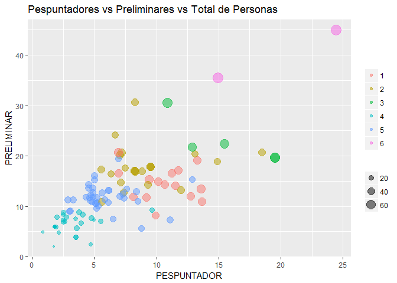

# Subir la eficiencia de pespunte creando familias de productos
Luis Espinosa Bouvy - espinosabouvy@gmail.com  
4 de noviembre de 2016  
.  


  
  
  
####RESUMEN GENERAL
Crear familias de productos que tengan un tiempo de proceso similar, una necesidad de personal  
especializado con la menor desviación posible, genera estabilidad en la producción, menor diferencia  
entre las capacidades de producción diarias y mayores eficiencias en el balanceo del trabajo.  

Si conocemos los tiempos de proceso de cada modelo y los conocimientos que debe tener la persona  
que debe realizar cada operacion (su especialización) , podemos agrupar modelos para que  
las diferencias del tiempo requerido para producirlos sea la menor posible.  Eso es lo que se busca  
con este análisis.


Se establecieron los siguientes objetivos:  

1.  Agrupar modelos con requerimientos de personal similar.  
2.  Minimizar la desviación estandar del requerimiento de personal calificado y total.   
3.  Asignar a cada modelo su familia de pespunte.
4.  Establecer la menor cantidad de familias posible.  
.  


#### DESCRIPCION  
La producción de calzado tiene una alta desviación en las necesidades de mano de obra calificada  
según el tipo de producto que se fabrica y la temporada del año. 

<!-- -->

En la gráfica podemos ver que los **pespuntadores** requeridos para producir los modelos de  
nuestro análisis tiene una media de **4.75**
                                        , una desviación estandar de 
**3.86**, con un rango de 
**0.56, 25.59**  
pespuntadores para producir la misma cantidad de pares por hora.

Y un caso similar es el puesto de *C-PRELIMINAR* con media de **10.52**
                                                                      , una desviación estandar de 
**6.38**,  
y un rango de 
**0.4, 43.46**

Por lo tanto el siguiente análisis tiene como objetivo crear familias de producción en el área  
de pespunte, donde se encuentra la mayor dispersión en la necesidad de mano de obra para cada   
producto y donde de manera regular encontramos el cuello de botella de las fábricas de calzado.

La cantidad de doblilladores va de 1 a 2 personas y no es significativo para diferenciar un estilo  
de otro y por lo tanto se descartan como variables significativas.  Por otro lado, los pespuntadores  
y preliminares "C" son personas con menor grado de especialización y es posible capacitarlas y/o  
reclutarlas, así que tampoco serán consideradas individualmente en este análisis y entrarán estas  
3 variables en "total personas"

Se busca agrupar los modelos por familia, buscando la menor desviación estandar  
para la funciones críticas:  
*  **PESPUNTADOR** (todos los pespuntadores A y B)  
*  **PRELIMINAR** (todos los preliminares A y B)  
*  **TOTAL PERSONAS** (total de personas en todos los puestos de pespunte)  

Agrupando a los pespuntadores y preliminar críticas se busca que los puestos críticos definan la  
cantidad de pares que pueden hacerse y qué modelos realizar en cada familia de productos.   
Considerando que los puestos con nivel **B** pueden realizar funciones de nivel **A** con una  
menor velocidad.


#### CONDICIONES GENERALES

Las tablas requeridas para el análisis son:  
1. Listado de modelos a evaluar.  
2. **TIEMPOS** de proceso de cada modelo por actividad:  
(*ESTILO, DEPARTAMENTO, FUNCION, TIEMPO, PERSONAS, META*).  
Se utiliza el cálculo ya realizado de *PERSONAS* que se obtiene del tiempo total *(TIEMPO)*  
requerido para cada operacion por par (anteriormente balanceada) entre el tiempo total de trabajo  
diario (9.5 hrs) para producir 100 pares por hora.  
3. Modelos con venta o pronóstico de venta.   
.  


#### ANALISIS Y TRANFORMACION DE DATOS  

Las funciones *A-PESPUNTADOR y B-PESPUNTADOR* se agrupan en **PESPUNTADOR** y  
Las funciones *A-PRELIMINAR y B-PRELIMINAR* se agrupan en **PRELIMINAR**  

Para cada uno de estos 2 grupos, la relación entre pespuntadores y preliminares de cada estilo,  
se puede ver en la siguiente gráfica: 

<!-- -->

Se puede deducir del gráfico que al minimizar la desviación estandar entre los pespuntadores  
necesarios para los modelos al crear una familia se minimiza también para los preliminares en cierto  
grado, al tener un correlación de **0.66**.  

Esta afirmación parece lógica, pues por cada pespunte realizado, se requiere una cierta cantidad de  
preliminares que preparen el corte antes de coserlo, aunque es insuficiente, por la correlación que  
presentan.  Por lo tanto basar la creación de las familias únicamente agrupando la cantidad de  
pespuntadores, no es suficiente y es necesario incluir en el análisis otros puestos críticos.  

Realizando un **analisis de clusters**, incluyendo las 3 variables, podemos definir un número de familias  
que agrupen una cantidad significativa de modelos, para minimizar la desviación estandar, y al  
mismo tiempo crear la menor cantidad de familias de productos.

Como se puede ver en la siguiente gráfica, generar **3** familias parece lo más adecuado, pues a partir del  
nivel marcado con la línea roja, los modelos empiezan a agruparse en grupos cada vez  
más pequeños y generando mayor cantidad de familias. Pasando de 3 a 6, por lo que en este análisis  
agruparemos el 100% de nuestros productos en 3 grupos.

<!-- -->


Después de utilizar el dendograma para definir la cantidad de familias a utilizar y por medio de  
la metodología de clusters K-mean, que genera un punto común para un grupo de modelos basandose  
en su distancia dentro de la gráfica (x-pespuntadores, y-preliminares, z-total personas), generamos  
la siguiente asignación de modelos a cada grupo o familia.

El análisis se realiza definiendo **3** clusters, en este caso **3** familias.

La relacion promedio entre la cantidad necesaria de preliminares y pespuntadores para la producción  
de 100 pares por hora es de 1:1.6,
                                   y por lo tanto, el cálculo de la distancia entre puntos se desviará a agrupar los modelos con un número similar de preliminares, pues al graficar y medir la distancia que  
separa los puntos, estos estarán más alejados de los puntos con una cantidad de pespuntadores similar.  

En nuestro analisis vamos a dar más peso a agrupar el total de personas sobre pespuntadores o preli-  
minares; se ponderarán las variables utilizando la media de pespuntadores vs preliminar vs total de  
personas (todas las funciones) y su desviación std. De esta forma forzamos que se agrupen por total  
de personas, luego pespuntadores y posteriomente preliminares.  


```
## Missing values were displaced by the median of the corresponding variable(s)
```

<!-- --><!-- -->

En este gráfico se puede ver la cantidad de *PESPUNTADORES, PRELIMINARES y TOTAL DE PERSONAS*  
que se requieren para cada estilo, identificados por las familias anterioremente creadadas por medio  
de clusters. Y el tamaño de cada uno de los puntos representa la cantidad total de personas  
requeridas, el eje horizontal la cantidad de pespuntadores y el vertical la cantidad de preliminares  
para producir 100 pares por hora.  
De esta forma podemos ver gráficamente que los modelos con cantidad de pespuntadores  
similar quedan agrupados, excepto cuando la diferencia en el total de personas cambia de manera  
notable.  


#RESULTADO

Al final del análisis, se agruparon los modelos en familias para lograr la menor desviación estandar,  
lo que permite una desviación menor en los requerimientos de personal para producir los modelos  
asignados en cada familia.  Esto permite:

Al iniciar el análisis vimos que el promedio de pespuntadores para producir 100 pares por hora  era 4.75  
, con una desviación estandar de 3.86.
                                        Ahora encontramos 2 familias bien estandarizadas, con promedios  
de personal requerido bien diferenciado y deviaciones estandar menores a 1.8.  Mientras que una familia  
baja su desviación estandar a 2.97.

*  Requerir menor cantidad de personal, (el balanceo tendra una eficencia real mayor).  
*  Menor cantidad de movimientos internos y entre familias.
*  Realizar una programación más cercana a la realidad, sin la necesidad de utilizar los tiempos  
especificos de cada modelo para realizarla.
*  Dar a los cliente una fecha de entrega más real, pues la diferencia de producción diaria en  
cada familia tiene menor diferencia.
*  El personal sabe con mayor facilidad cuantos pares debe de producir hora con hora.

El paso siguiente a este análisis debe incluir la demanda o en su defecto el pronóstico de la  
demanda de cada modelo para obtener las plantillas de personal requerido para satisfacer las  
necesidades del cliente.

Posteriormente, comparando contra la plantilla actual de personal, podemos calcular las necesidades  
de reclutamiento y capacitación.  Del mismo modo, nuestra capacidad futura de producción o en su  
defecto nuestra capacidad sobrante.  


Para cada familia, la cantidad de **PESPUNTADORES** y su desviación la podemos ver en la siguiente tabla:  

|  FAMILIA|  avg|    sd|
|--------:|----:|-----:|
|        1|   14|  2.97|
|        2|    7|  1.76|
|        3|    3|  1.14|

Para cada familia, la cantidad de **PRELIMINARES** y su desviación la podemos ver en la siguiente tabla:  

| FAMILIA| avg|   sd|
|-------:|---:|----:|
|       1|  17| 4.86|
|       2|  14| 3.23|
|       3|   8| 2.13|


