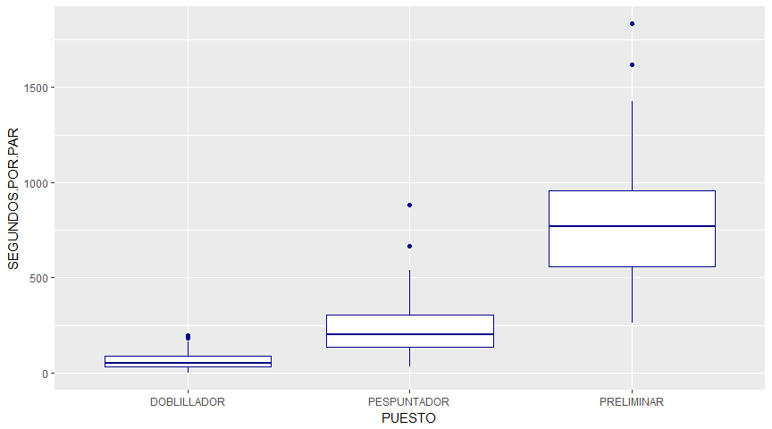
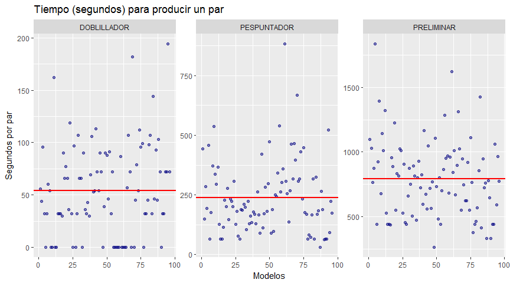
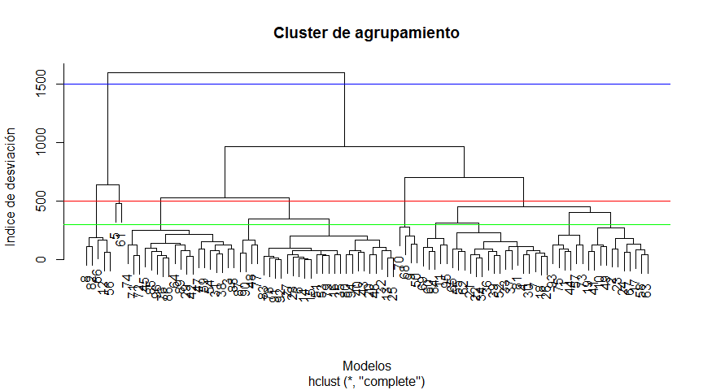
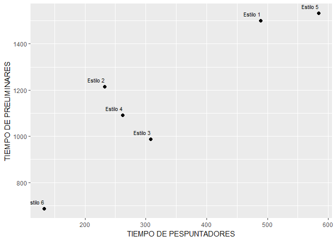
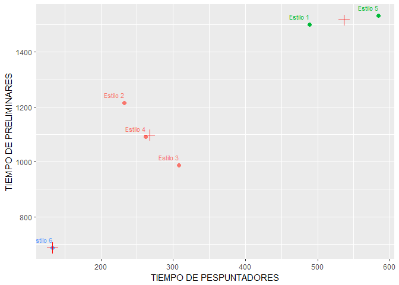
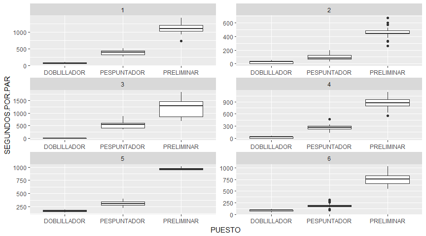

# Subir la productividad de pespunte en fábricas de calzado asignando eficientemente los modelos a diferentes líneas de producción
Luis Espinosa Bouvy - luis@magro.com.mx  
28 de noviembre de 2016  

<style type="text/css">
.table {

    width: 40%;

}
</style>


###RESUMEN  

Las fábricas de producción de calzado se encuentran en algún momento con la necesidad de producir mayor cantidad de modelos con bajo volumen.  Se venden muchos modelos en menores cantidades y deben hacerlo con la mayor productividad posible para no afectar sus margenes de utilidad y ser lo más eficiente posible.

Un reto es definir en cuál de las líneas de producción hacer cada uno de esos modelos para que se produzca una cantidad consistente de pares hora con hora y con el menor cambio en la cantidad de personas necesarias para producir cada uno, es decir, producir modelos similares en cada línea de producción.  

**La propuesta de este artículo es utilizar el tiempo que se debe invertir en la producción de cada modelo para definir en donde debe producirse.**

Crear lineas de producción que tengan tiempos de proceso similar en el pespunte, es decir, una necesidad de personal con la menor desviación posible entre un producto y otro, genera estabilidad en la producción, una menor diferencia entre las capacidades de producción diaria y mayores eficiencias en el balanceo del trabajo.  

Las fábricas saben cuanto tiempo de proceso lleva cada modelo, pues así conocemos el costo de mano de obra de cada uno, por lo tanto, podemos utilizar esa información para tomar la mejor decisión de donde producir cada uno y cuanta gente necesitamos para producirlos.  

**El resultado de utilizar de manera profesional la información que tenemos a la mano en nuestros softwares de producción y ERPs puede dar diminuciones en la variación del tiempo en las líneas de producción del 70%, como es el caso de este análisis**

Al final del artículo se puede encontrar la agrupación final de los modelos que se usaron para este ejercicio.  

### CONCEPTOS GENERALES    
Para este artículo utilizaremos datos generales de producción de una fábrica de calzado, donde la información generada tiene el siguiente formato y cada columna representa el tiempo, en segundos, necesario para fábricar un par de zapatos en área de pesunte:  *(La tabla completa de modelos y tiempos utilizada se puede ver en el apendice A)*

| ESTILO| DOBLILLADOR| PESPUNTADOR| PRELIMINAR|
|------:|-----------:|-----------:|----------:|
|      1|          56|         443|       1097|
|      2|          44|         150|       1027|
|      3|          96|         285|        767|
|      4|          32|         193|        876|
|      5|           0|         458|       1834|
|      6|          32|          64|        442|

Los datos tienen las siguientes características:  

1. Se utilizarán 96 modelos diferentes en el análisis, con necesidades diferentes cada uno.  

2. Los tiempos están en segundos. 

2. Las operaciones de corte y rebajado están en un proceso anterior de pre-pespunte, por lo que dichas operaciones y puestos no aparecen en este ejercicio.

Para entender un poco la complejidad de la situación actual en la industria de los zapatos, vamos revisar un poco estos datos y explicar algunos conceptos que serán útiles para entender mejor el objetivo de este artículo.

En la siguiente tabla podemos ver las diferencias entre el tiempo necesario que debemos invertir en cada modelo para producir un par de zapatos de cada uno.

<!-- -->
 

Se puede deducir la la siguiente gráfica lo siguiente:

1. Existe una diferencia considerable en el promedio de tiempo que se requiere de cada uno de los puestos y vemos que la mayor parte de nuestro personal serán preliminares, luego pespuntadores y lo que menos necesitamos son doblilladores.  

2. Cada una de las cajas y sus líneas representan la mediana y cada uno de los quantiles de cada puesto, por ejemplo:
     
     * Para los preliminares.  

```
##   0%  25%  50%  75% 100% 
##  263  558  772  959 1834
```

El 25% de los estilos utilizan 558 segundos o menos, la mitad 772 segundos o menos.

Por lo tanto, podemos imaginar lo imporante que es agrupar la producción de los modelos en forma correcta o terminaremos produciendo modelos que necesitan 2400 segundos por par (40 minutos) junto con modelos que requieren 350 segundos por par (6 minutos).  Solo como un ejercicio que vuelva un poco más claro esto, supongamos que debemos producir 700 pares de estos dos modelos, vamos a calcular cuanta gente necesitamos para producirlos...

Modelo de **2400** segundos por par:

|Pares a producir|Tiempo Preliminares|Tiempo total|Horas/Minutos Trabajo|Preliminares|
|----------------|-------------------|------------|---------------------|------------|
|700 pares       | 40 minutos/par    |28,000 min. |  8 hrs/ 480 min     | 59 pers    |


Modelo de **350** segundos por par:  

|Pares a producir|Tiempo Preliminares|Tiempo total|Horas/Minutos Trabajo|Preliminares|
|----------------|-------------------|------------|---------------------|------------|
|700 pares       | 5.8 minutos/par   |4,060 min.  |  8 hrs/ 480 min     | 9 pers     |

Es una diferencia considerable que para algunos modelos necesitamos 59 preliminares y para otros únicamente 9, para producir la misma cantidad de pares.  

**Esta diferencia, respecto al promedio se le conoce como desviación estandar y esta deviación es lo que trataremos de minimizar al agrupar los modelos correctamente.**  

Para tener un punto de referencia, vamos a revisar el promedio que necesitamos de cada puesto y su desviación.  Al final del artículo podremos revisar cuanto mejoramos estos datos y podremos cuantificar la mejora al agrupar correctamente los modelos en líneas de producción.  


|PUESTO      | Promedio| Desviacion| Porcentaje|
|:-----------|--------:|----------:|----------:|
|DOBLILLADOR |       55|         44|      80.00|
|PESPUNTADOR |      238|        148|      62.18|
|PRELIMINAR  |      794|        294|      37.03|

Gráficamente, estas diferencias se ven de la siguiente forma:
<!-- -->

Donde la línea roja representa el promedio de tiempo necesario para cada puesto y cada uno de los puntos es un estilo, con el tiempo requerido de cada puesto para producir un par.  

### EXPLICACION DEL ANALISIS  

Utilizaremos 2 metologías para llegar a la mejor forma de agrupar los modelos en líneas de producción, el primero nos ayudará a definir la cantidad de líneas de producción que resulta conveniente generar y la segunda será la definición de cuales modelos debe asignarse a cada una de esas líneas.


#### CANTIDAD DE LINEAS DE PRDUCCIÓN  

Para definir cuantas familias, vamos a revisar cuanta desviación hay entre los modelos de forma visual mediante un árbol de agrupamiento.

<!-- -->

```
## numeric(0)
```

En el análisis gráfico se marcan con líneas 3 diferentes opciones y se debe tomar una decisión que no únicamente está basada en los tiempos de los modelos y se explicará más adelante la razón. Cada una de las líneas representa la creación de diferente cantidad de líneas de producción como podemos ver en la siguiente tabla:

| Linea azul | Líneas de producción |
|------------|----------------------|
|Azul       | 2               |
|Roja       | 6               |
|Verde       | 11               |

La decisión de cuantas líneas de producción no únicamente tiene que estar basada en minimizar la desviación entre los modelos a producir por una razón sencilla, la menor desviación la encontramos teniendo una línea de producción para cada modelo y para el caso de nuestro analisis la razón de agrupar modelos viene del hecho de tener cada vez menores pedidos de una mayor cantidad de modelos, así que asumir que podemos crear una línea de producción para cada modelo vuelve imposible la programación de la producción  pues la demanda diaria de cada uno de ellos no es constante. 

Algunas consideraciones serían:  

1. Estabilidad de la demanda para mantener a todas las líneas de producción trabajando todos los días.  

2. El costo de supervisión de cada una de las líneas.  

3. Entre mayor sea la cantidad de líneas de producción, el tackt-time (ritmo de proceso) se vuelve mayor y la cantidad de cambios de modelo se vuelve menor.  

4. Un mayor tackt-time implica buffers (inventarios entre procesos) mayores para evitar mayor cantidad de cambios de modelo en los procesos anteriores y posteriores.  

5. Mayor cantidad de máquinas no flexibles (ojillar, doblillar, rebajar, etc), pues una menor cantidad de modelos por línea de producción genera que algunas máquinas no sean aprovechadas al 100% si no se encuentran en la ruta crítica del balanceo del trabajo, pero se deberá tener una por cada línea de producción.

Tomar en cuenta cuantitativamente estas consideraciones no es parte de esta análisis, pues los costos de estas cambian de empresa a empresa y la intensión es que pueda ser utilizado por la generalidad de empresas de calzado con la problematica de tener muchos modelos con menores ventas de cada uno de ellos.

Para este análisis agruparemos los modelos a producir en **6** líneas de producción.

#### DEFINICIÓN DE MODELOS POR LÍNEA DE PRODUCCIÓN  

Para explicar un poco como es que se realiza esta agrupación vamos a realizar un ejemplo sencillo que incluye únicamente pespuntadores y preliminares y verlo gráficamente.

Supongamos los siguientes modelos:


| ESTILO| PESPUNTADOR| PRELIMINAR|
|------:|-----------:|----------:|
|      1|         489|       1501|
|      2|         232|       1214|
|      3|         308|        987|
|      4|         262|       1091|
|      5|         584|       1532|
|      6|         133|        687|

El análisis que utilizaremos se basa en la idea de agrupar los modelos con la menor distancia entre ellos, podemos imaginar de mejor manera esto si lo vemos gráficamente.  

<!-- -->

En este caso, sería muy lógico pensar en dos o tres grupos, basandonos en las distancias entre los puntos, para 2 grupos, juntaríamos los estilos 1 y 5, y en otro grupo, el resto y si quisieramos hacer 3 grupos, se vería de la siguiente forma:

<!-- -->

Al ser un ejemplo sencillo, donde únicamente debemos agrupar los modelos con tiempos de proceso de PESPUNTADORES y PRELIMINARES similares se puede entender el concepto general de la metología que se utilizará.

Las "cruces" en el gráfico representan los promedios de pespuntadores y preliminares que tendría cada línea de producción.

Al utilizar esta metología para todos los modelos de nuestro artículo y todos los puestos que estamos utilizando para agrupar, obtenemos cuáles modelos deben producirse en cada línea de producción. *(La tabla completa se puede ver en el apendice B)*


Podemos ver gráficamente como quedaron asignados los modelos en las siguientes gráficas:  
<!-- -->

### RESULTADOS   

Al iniciar obtuvimos los valores general sin agrupar los estilos en líneas de producción en la siguiente tabla:


|PUESTO      | Promedio| Desviacion| Porcentaje|
|:-----------|--------:|----------:|----------:|
|DOBLILLADOR |       55|         44|      80.00|
|PESPUNTADOR |      238|        148|      62.18|
|PRELIMINAR  |      794|        294|      37.03|

Los valores promedio de las desviaciones después de agrupar los modelos en 6 líneas de producción queda de la siguiente forma: *(Se puede consultar la tabla completa de las desviación para cada una de las líneas de producción en el apendice C)*

|PUESTO      | Promedio| Desviacion| Porcentaje|
|:-----------|--------:|----------:|----------:|
|DOBLILLADOR |       64|          9|      14.06|
|PESPUNTADOR |      297|         52|      17.51|
|PRELIMINAR  |      894|        142|      15.88|

Al final se logra bajar la desviación en el tiempo promedio necesario para producir los estilos de:

| PCT.INICIAL | PCT.FINAL | DISMINUCION DE DESVIACION |
|:-----------:|:---------:|:-------------------------:|
|    80.00    |   14.06   |          82.42%           |
|    62.18    |   17.51   |          71.84%           |
|    37.03    |   15.88   |          57.12%           |


En conclusión asignar correctamente los modelos que debemos producir y determinar de manera profesional cuantas líneas de producción tener, mejora considerablemente la productividad, permite tener metas diarias de producción constantes y facilita el trabajo diario de supervisores y jefes en el balanceo del trabajo diario. 

La segunda parte de este ejercio sería determinar la plantilla de personal necesaria en cada una de las líneas de producción utilizando la demanda de cada modelo.

Una tercera y última parte tendría que considerar la programación diaria de producción de cada una de estas líneas, determinar las necesidades diarias de personal de cada puesto y realizar movimientos de personas entre las diferentes líneas de producción día con día.

### CONTACTO  

Si tienes dudas sobre este artículo o estas interesado en implementar mejoras como esta en tu empresa, envíanos un correo a luis@magro.com.mx o en nuestro sitio web [www.magro.com.mx](www.magro.com.mx)  

!-- Te invitamos a que realices este mismo análisis, sin costo, con los datos reales de tu empresa en nuestro sitio web en [Lineas de produccion de calzado](www.magro.com.mx/lineasProdCalzado) --

### APENDICE A  

Tabla de modelos y sus tiempos de proceso

| ESTILO | DOBLILLADOR | PESPUNTADOR | PRELIMINAR |
|:------:|:-----------:|:-----------:|:----------:|
|   1    |     56      |     443     |    1097    |
|   2    |     44      |     150     |    1027    |
|   3    |     96      |     285     |    767     |
|   4    |     32      |     193     |    876     |
|   5    |      0      |     458     |    1834    |
|   6    |     32      |     64      |    442     |
|   7    |     60      |     175     |    925     |
|   8    |     54      |     371     |    1396    |
|   9    |      0      |     537     |    679     |
|   10   |      0      |     336     |    1141    |
|   11   |     162     |     295     |    1011    |
|   12   |      0      |     366     |    1323    |
|   13   |      0      |     126     |    528     |
|   14   |     32      |     64      |    442     |
|   15   |     32      |     64      |    442     |
|   16   |     32      |     114     |    438     |
|   17   |     30      |     229     |    958     |
|   18   |     90      |     202     |    890     |
|   19   |     66      |     278     |    1224    |
|   20   |     77      |     147     |    549     |
|   21   |     66      |     234     |    833     |
|   22   |     36      |     222     |    814     |
|   23   |     119     |     200     |    1025    |
|   24   |     32      |     307     |    1012    |
|   25   |      0      |     126     |    528     |
|   26   |     97      |     182     |    908     |
|   27   |      0      |     77      |    456     |
|   28   |     32      |     64      |    442     |
|   29   |     107     |     188     |    659     |
|   30   |     66      |     185     |    875     |
|   31   |     66      |     211     |    752     |
|   32   |      0      |     198     |    506     |
|   33   |     90      |     105     |    893     |
|   34   |     36      |     222     |    814     |
|   35   |     32      |     128     |    474     |
|   36   |     43      |     161     |    800     |
|   37   |     30      |     134     |    930     |
|   38   |     69      |     178     |    722     |
|   39   |     106     |     169     |    823     |
|   40   |     53      |     130     |    598     |
|   41   |     54      |     262     |    1166    |
|   42   |     113     |     166     |    674     |
|   43   |     72      |     90      |    559     |
|   44   |     54      |     422     |    1046    |
|   45   |     90      |     113     |    721     |
|   46   |     72      |     171     |    564     |
|   47   |      0      |     283     |    769     |
|   48   |     39      |     180     |    263     |
|   49   |     90      |     297     |    1106    |
|   50   |     88      |     473     |    734     |
|   51   |     46      |     90      |    482     |
|   52   |     91      |     189     |    799     |
|   53   |     32      |     96      |    442     |
|   54   |     72      |     251     |    702     |
|   55   |      0      |     242     |    867     |
|   56   |      0      |     341     |    1286    |
|   57   |      0      |     540     |    951     |
|   58   |      0      |     262     |    969     |
|   59   |      0      |     303     |    684     |
|   60   |     87      |     359     |    962     |
|   61   |      0      |     882     |    1621    |
|   62   |      0      |     306     |    841     |
|   63   |      0      |     256     |    1010    |
|   64   |      0      |     136     |    671     |
|   65   |     57      |     268     |    899     |
|   66   |     107     |     464     |    1310    |
|   67   |     72      |     318     |    1023    |
|   68   |      0      |     466     |    552     |
|   69   |     182     |     397     |    946     |
|   70   |      0      |     668     |    746     |
|   71   |     45      |     306     |    625     |
|   72   |     79      |     317     |    624     |
|   73   |     54      |     430     |    921     |
|   74   |     112     |     233     |    552     |
|   75   |     96      |     447     |    1112    |
|   76   |     99      |     175     |    763     |
|   77   |      0      |     169     |    378     |
|   78   |     32      |     64      |    442     |
|   79   |     32      |     82      |    464     |
|   80   |     45      |     72      |    568     |
|   81   |     98      |     165     |    858     |
|   82   |     107     |     317     |    1427    |
|   83   |     32      |     64      |    416     |
|   84   |     144     |     325     |    948     |
|   85   |     46      |     169     |    722     |
|   86   |     93      |     183     |    761     |
|   87   |     45      |     30      |    330     |
|   88   |     103     |     266     |    779     |
|   89   |     72      |     189     |    644     |
|   90   |      0      |     63      |    331     |
|   91   |     32      |     64      |    442     |
|   92   |     32      |     64      |    442     |
|   93   |     72      |     521     |    1061    |
|   94   |     72      |     91      |    590     |
|   95   |     194     |     222     |    967     |
|   96   |     72      |     173     |    774     |

### APENDICE B  

Tabla de modelos asignados a cada línea de producción

|LINEA.PRODUCCION |ESTILO |
|:----------------|:------|
|1                |1      |
|1                |8      |
|1                |19     |
|1                |41     |
|1                |44     |
|1                |49     |
|1                |50     |
|1                |60     |
|1                |66     |
|1                |67     |
|1                |73     |
|1                |75     |
|1                |82     |
|1                |93     |
|2                |6      |
|2                |13     |
|2                |14     |
|2                |15     |
|2                |16     |
|2                |25     |
|2                |27     |
|2                |28     |
|2                |32     |
|2                |35     |
|2                |40     |
|2                |48     |
|2                |51     |
|2                |53     |
|2                |64     |
|2                |77     |
|2                |78     |
|2                |79     |
|2                |80     |
|2                |83     |
|2                |87     |
|2                |90     |
|2                |91     |
|2                |92     |
|3                |5      |
|3                |9      |
|3                |12     |
|3                |56     |
|3                |57     |
|3                |61     |
|3                |70     |
|4                |2      |
|4                |4      |
|4                |10     |
|4                |17     |
|4                |22     |
|4                |24     |
|4                |34     |
|4                |36     |
|4                |37     |
|4                |47     |
|4                |55     |
|4                |58     |
|4                |59     |
|4                |62     |
|4                |63     |
|4                |65     |
|4                |68     |
|4                |71     |
|5                |11     |
|5                |69     |
|5                |84     |
|5                |95     |
|6                |3      |
|6                |7      |
|6                |18     |
|6                |20     |
|6                |21     |
|6                |23     |
|6                |26     |
|6                |29     |
|6                |30     |
|6                |31     |
|6                |33     |
|6                |38     |
|6                |39     |
|6                |42     |
|6                |43     |
|6                |45     |
|6                |46     |
|6                |52     |
|6                |54     |
|6                |72     |
|6                |74     |
|6                |76     |
|6                |81     |
|6                |85     |
|6                |86     |
|6                |88     |
|6                |89     |
|6                |94     |
|6                |96     |

### APENDICE C  

Tabla desviaciones por línea de producción


| LINEA.PRODUCCION|PUESTO      | Promedio| Desviacion| Porcentaje|
|----------------:|:-----------|--------:|----------:|----------:|
|                1|DOBLILLADOR |       76|         21|      27.63|
|                1|PESPUNTADOR |      386|         82|      21.24|
|                1|PRELIMINAR  |     1114|        187|      16.79|
|                2|DOBLILLADOR |       26|         18|      69.23|
|                2|PESPUNTADOR |       98|         44|      44.90|
|                2|PRELIMINAR  |      457|         87|      19.04|
|                3|DOBLILLADOR |        0|          0|        NaN|
|                3|PESPUNTADOR |      542|        188|      34.69|
|                3|PRELIMINAR  |     1206|        437|      36.24|
|                4|DOBLILLADOR |       22|         21|      95.45|
|                4|PESPUNTADOR |      259|         79|      30.50|
|                4|PRELIMINAR  |      866|        150|      17.32|
|                5|DOBLILLADOR |      171|         23|      13.45|
|                5|PESPUNTADOR |      310|         73|      23.55|
|                5|PRELIMINAR  |      968|         31|       3.20|
|                6|DOBLILLADOR |       85|         19|      22.35|
|                6|PESPUNTADOR |      187|         53|      28.34|
|                6|PRELIMINAR  |      749|        125|      16.69|


